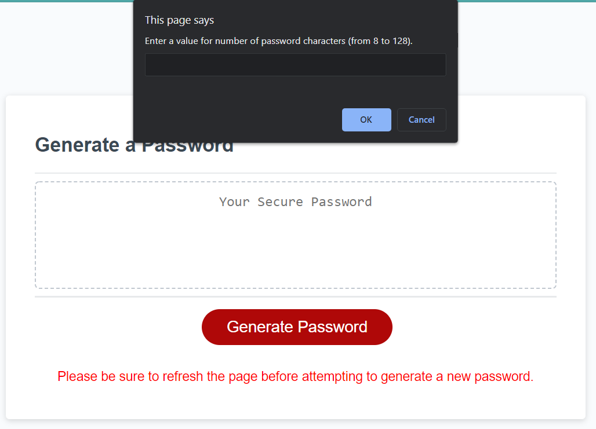

# password-generator

## Purpose
JavaScript password generator that will provide a randomly generated password that fits user selected criteria including character length, uppercase, lowercase, numeric, and special character inclusion.

The available criteria is arranged within a nested array and as the user makes criteria selections the array is spliced accordingly. This does necessitate that users refresh the page before attempting to generate a new password in order to reset the available array items.

_Page Sample Screenshot:_

### Access

Access the live site [here!](https://lsabin23.github.io/password-generator/)

### Known Issues

There is currently a known issue where the password is generated, but not displayed, however this is not consistently reproducible. 

If you experience this issue please add to the open issue [here](https://github.com/LSabin23/password-generator/issues) and include the steps used to reproduce the problem.
